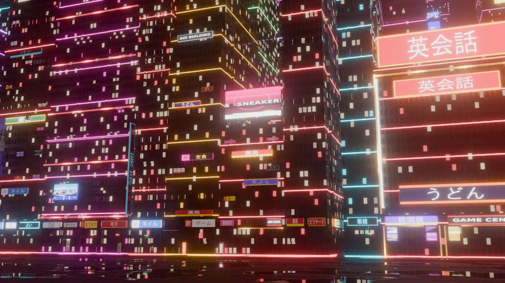
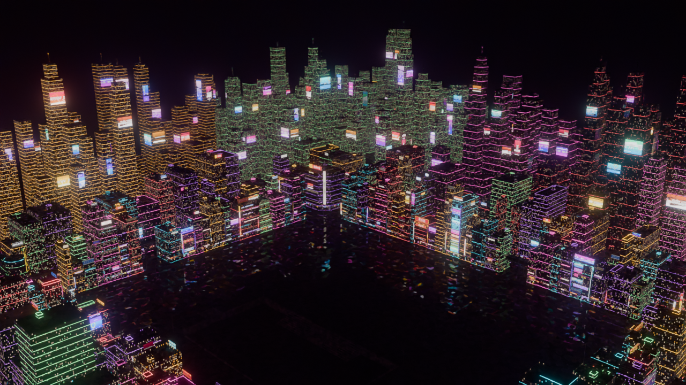

# tokyo-cyberpunk

Turns the `HEX_City_00_FULL_CITY.fbx` map into a neon cyberpunk city, for **Roblox Studio** and for Blender.

## Roblox Studio

Files in `roblox/`:

- `HEX_City_Cyberpunk_Roblox.fbx` – the map, re-dressed and textured:
  - dark futuristic facades (metal/concrete panels, strip windows), concrete roofs and props, asphalt streets
  - lit window panes placed on the real walls (`__glow`), neon roof crowns / corner strips / floor bands (`__neon`)
  - Shinjuku-style vertical kanji blade signs (`__blade`) and holographic billboards floating off facades and on rooftops (`__holo`), using the map's own ad/sign art
  - rooftop antennas with beacons
- `CyberpunkCity.rbxmx` – scripts: turn the neon/glow parts into `Neon`, put glowing animated overlays on every screen, hologram and sign (scrolling ads, scan lines, hologram flicker, glitches, faulty neon), blinking beacons, flying cars with light trails, and a blue-purple night (`Atmosphere`, `Bloom`, colour grading)
- `textures/` – every texture as a loose PNG

Steps:

1. **File → Import 3D**, pick `roblox/HEX_City_Cyberpunk_Roblox.fbx` and import.
2. In the Explorer, right-click **Workspace → Insert from File…** and pick `roblox/CyberpunkCity.rbxmx`.
3. Paste into the **command bar** and press Enter, so the look shows while editing (and Lighting switches to Future):
   `require(workspace.CyberpunkCity.CyberpunkSetup).run()`
4. Press **Play** for the animation (scrolling holograms, flying cars, flicker).

Tweak `CyberpunkCity.CyberpunkConfig` (brightness, window glow, flying cars, colours).
Rebuild the Roblox files with:

```sh
blender -b -P blender/export_roblox.py -- assets/HEX_City_00_FULL_CITY.fbx roblox/
python3 roblox/build_rbxmx.py
```

## Blender




`docs/previews/street_024.png` vs `street_036.png` shows the billboard scroll half a second apart.

## Repo layout

- `assets/HEX_City_00_FULL_CITY.fbx` – the original map
- `blender/cyberpunk_city.py` – the conversion script
- `output/HEX_City_cyberpunk.blend` – ready-made result (textures packed); open it and press Space to play

## What changes

| Part of the map | Before | After |
|---|---|---|
| Everything on `HEX_Palette` (props, poles, misc) | flat palette colour | procedural **concrete**: grain, stains, rain streaks, formwork seams, bump, palette tint kept |
| `Street_*` / ground | flat colour | dark **wet asphalt-concrete** with reflective puddles |
| `Tower.*` / tall buildings | flat colour | dark weathered concrete, **glowing window grid** (random lit windows), **pulsing neon floor bands** and **neon roof crown**, one accent colour per building |
| `Billboard_*` (`Screen_Atlas`) | static image | **animated**: each ad scrolls inside its own atlas cell, LED pixel grid, rolling scan bar, hue drift, flicker, glitch tearing, rare blackouts; desynced per billboard |
| `Sign_*` lit signs | static emission | breathing neon, ~18% buzz like faulty tubes |
| `*_LED` facade strips | flat colour | neon strips with a light pulse chasing along them |
| World | – | night sky, volumetric haze, bloom, AgX Punchy, camera, 10 s loop @ 24 fps |

Everything is procedural (no extra texture files) and works with no UV changes:
3D noise and box projection mean concrete never stretches.

## Usage

Requires Blender 4.2+ (tested with Blender 5.2; the FBX was exported from 5.0).

```sh
blender -b -P blender/cyberpunk_city.py -- assets/HEX_City_00_FULL_CITY.fbx output/HEX_City_cyberpunk.blend --still preview.png
```

Options:

- `--still file.png` – render a preview frame
- `--spin-landmarks` – also physically rotate the `Billboard_LandmarkCurved` objects
- `--no-fog` – disable the volumetric haze
- `--scale 0.01` – override world-unit scale for textures (auto-detects cm exports)

Or import the FBX in Blender, open `blender/cyberpunk_city.py` in the Text Editor and press **Run Script**
(works on the open scene, saves nothing). Press **Space** in the viewport (Material Preview / Rendered) to watch
the billboards animate.

## Game engines

FBX cannot store procedural shaders or animated materials. To use the look in Unity/Unreal/Godot, bake the
concrete materials to textures in Blender, and recreate the billboard scroll with a UV-panning shader
(the per-face `cp_rect_min` / `cp_rect_size` / `cp_scroll` attributes describe each screen's atlas cell).
