# tokyo-cyberpunk — HEX! City v3 (current)

v3 drops the cyberpunk redesign and goes back to the **original map**
(`assets/HEX_City_00_FULL_CITY.fbx`). Every original object is kept unchanged. Much more
Shibuya-style detail is added on top, along with game-themed ads that all rotate.

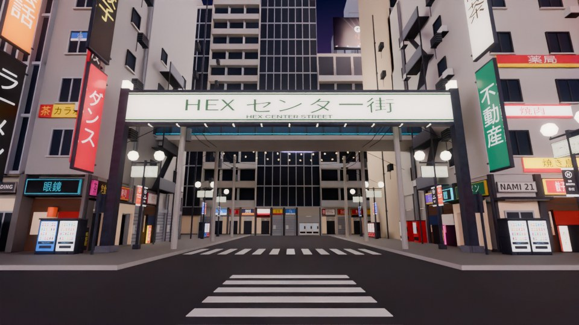

| | |
|---|---|
| `export_v3/HEX_City_v3_A.fbx` | the original map, every object unchanged (verified) — 18.3 MB |
| `export_v3/HEX_City_v3_B.fbx` | the new detail — 8.7 MB |
| `export_v3/textures/` | PNGs; copy them next to the FBX files when importing |
| `export_v3/roblox/HEXCityV3.rbxmx` | setup, animator, config and `CityData` |
| `export_v3/HOW_TO_IMPORT.txt` | Roblox Studio steps |
| `export_v3/VERIFICATION.md` | results of the re-import check |
| `output/HEX_City_v3.blend` | the editable Blender scene |

File B contains:
- a rotating screen on every original billboard;
- 35 moderation-safe ads, made with `blender/hex3_ads.py`;
- 58 rooftop billboards and 4 landmark LED screens;
- 243 blade signs;
- 4 gateway arches;
- Center-gai lamps, string lights, signals and bollards;
- 96 vending machines, plus AC units and pipes on the side-street walls;
- rooftop equipment on 219 roofs;
- glow data for all 733 lit signs of the original map.

To build it:

    /opt/bvenv/bin/python blender/hex3_ads.py
    /opt/bvenv/bin/python blender/hex3_build.py
    /opt/bvenv/bin/python blender/hex3_verify.py
    python3 export_v3/roblox/build_rbxmx.py

---

## Previous version: HEX! Cyberpunk City v2

A full architectural redesign of the city around the HEX! basketball park
(`assets/HEX_City_00_FULL_CITY.fbx`): futuristic Tokyo / Shibuya megastructures, skyscraper-scale
digital advertising, dense neon and a layered megacity skyline — built for **Roblox Studio** at night.
The basketball park itself (plaza, courts, sunken practice area, stairs, streets, masts, viaduct) is
untouched and verified identical to the original.

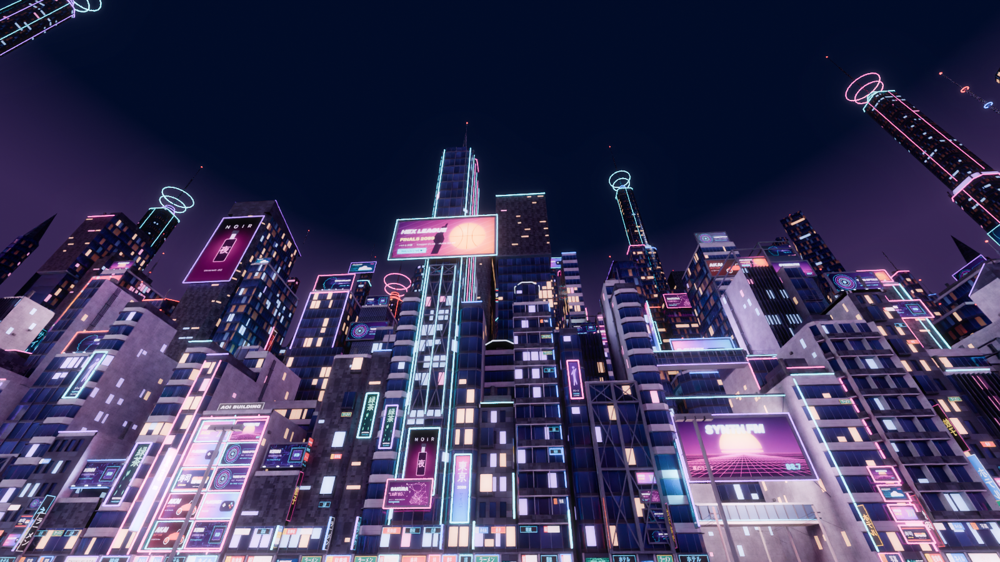

## Deliverables

| | |
|---|---|
| `export/HEX_Cyberpunk_City_A.fbx` | park (once) + foreground buildings, corner landmarks, storefronts, billboard structures — **18.0 MB** |
| `export/HEX_Cyberpunk_City_B.fbx` | midground towers, skyline, 12 megatowers — **14.1 MB** |
| `export/textures/` | all PNG maps (copy them next to the FBX files when importing; the FBX references bare file names): 10 PBR sets (Color / Normal / Roughness / Metalness, 1024²), 38 original campaign-style ad artworks, the map's 2 sign atlases, Neon swatches |
| `export/ROBLOX_SETUP_GUIDE.md` | import steps + texture / material assignment guide for Roblox Studio |
| `export/texture_assignment.csv`, `export/screens.csv` | every MeshPart → material → PNG maps → Roblox setting; every screen → ad texture |
| `export/roblox/CyberpunkCityV2.rbxmx` | setup + animation scripts and `CityData` (screen panels, lights, alignment) |
| `export/VERIFICATION.md` | re-import check of both FBX files (sizes, alignment, preserved geometry, UVs, textures) |
| `output/HEX_Cyberpunk_City.blend` | the editable Blender project (collections `A_*` → file A, `B_*` → file B) |
| `output/HEX_City_00_original_backup.blend` | backup of the original scene before any change |

Both FBX files share the original file's origin, units (1 unit = 1 stud) and axes, so they import
on top of each other without repositioning; `HEX_ALIGN_A/B` marker cubes let the setup script check and fix it.

## What changed

* **Foreground (105 lots + 4 corner landmarks), file A** — every building replaced, on the original lots and
  street lines. Archetypes per lot type (zakkyo stacks, balcony mansions, louvre towers, pencil towers, curved / stepped
  modern towers, arcades, low blocks with giant rooftop billboards, 4 mega ad towers), each with its own random
  facade system (curtain wall with fins, ribbon windows with sun-shades, punched recessed windows, louvres, balconies,
  tech panelling, exoskeleton bracing), cantilevers, chamfers, projecting bay boxes, varied crowns (stepped, slanted,
  open steel frame with screen, machine house, helipad), lattice comm towers, exhaust stacks and instanced rooftop machinery.
* **Corner landmarks** — NE glass drum wrapped by a 134-stud curved screen with ring crown and needle; NW stepped
  department megablock with two giant facade screens and a 45° rooftop billboard; SE angular tower with a giant chamfer
  screen, exoskeleton and cantilevered prow; SW Shibuya-109-style drum with a wrap screen and a 520-stud needle tower
  with floating holo rings.
* **Street level (Shibuya)** — narrow recessed shops with lit glass, display counters and shelving, sign fascias from
  the map's own sign atlases, LED-lit canopies, noren curtains, lanterns, A-frame signs, vending machines, vertical blade
  signs, floor-directory signs, service alleys with duct risers, fire escapes and AC units, ad panels and glass
  skybridges spanning the four side streets.
* **Advertising** — 346 screens, each a separate mesh: giant recessed facade screens, skyscraper-scale truss-mounted
  screens above the neighbours, layered screens, curved corner wraps, cantilevered and rooftop billboards, arcade screen
  walls, storefront tickers. 38 original campaign-style artworks in 6 formats (brand lockups, rendered hero objects,
  no clip-art), moderation-safe: no QR codes, barcodes, prices, links or gambling.
* **Midground (111 lots) and skyline (426 towers + 12 megatowers), file B** — setbacks, cantilevered tops, crowns,
  big facade screens above the foreground roofline; skyline in 10 silhouette families (stepped, octagonal spire,
  twisting, finned cylinder, twin towers with bridges, cantilevered, hexagonal, clusters, slabs) merged per sector;
  megatowers 900–1,700 studs with sky lobbies, neon ribs, giant screens and holo rings.
* **Built windows (v2.1)** — every window is real geometry: reveals, recessed glass, mullions, transoms and sills;
  curtain walls have projecting mullion grids and floor transoms; lit windows show a room set back behind the frame
  (with desks, shelving or blinds) and follow tenancy — whole office floors, individual flats, dark floors.
* **Lighting hierarchy** — neon on signs, shopfronts, canopies, billboards and the landmark crowns / ribs only;
  no outlined building edges.

## Previews (Blender Cycles approximation of the Roblox night setup)

| | |
|---|---|
| 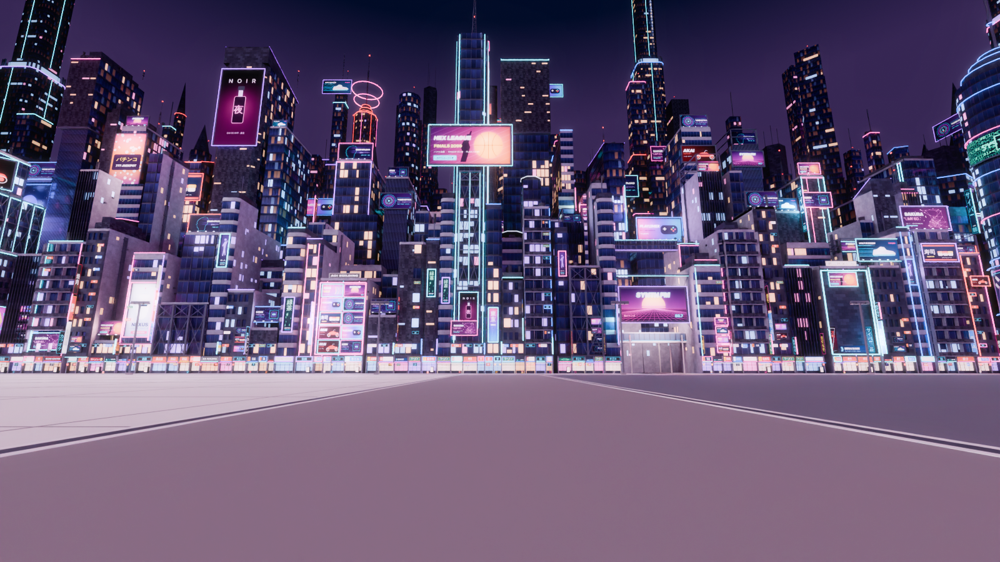 | 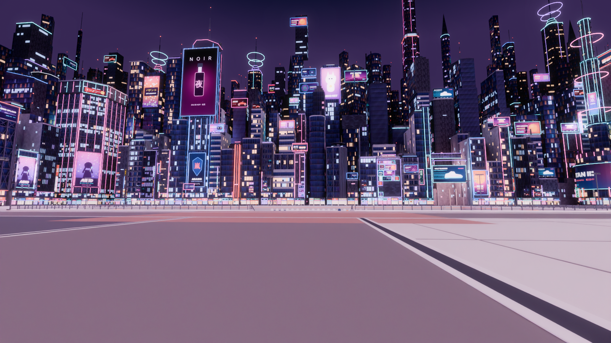 |
| 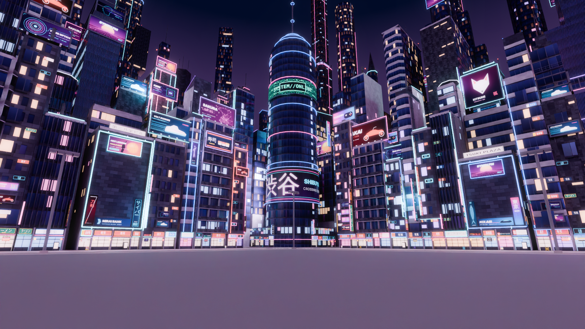 | 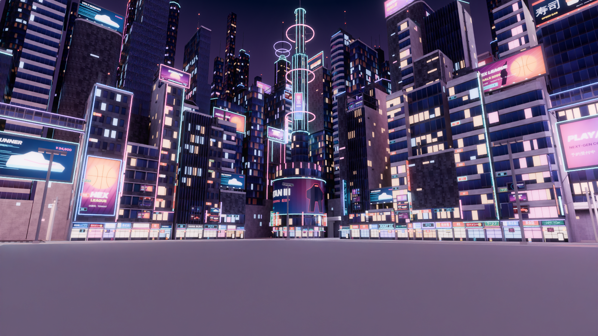 |
| 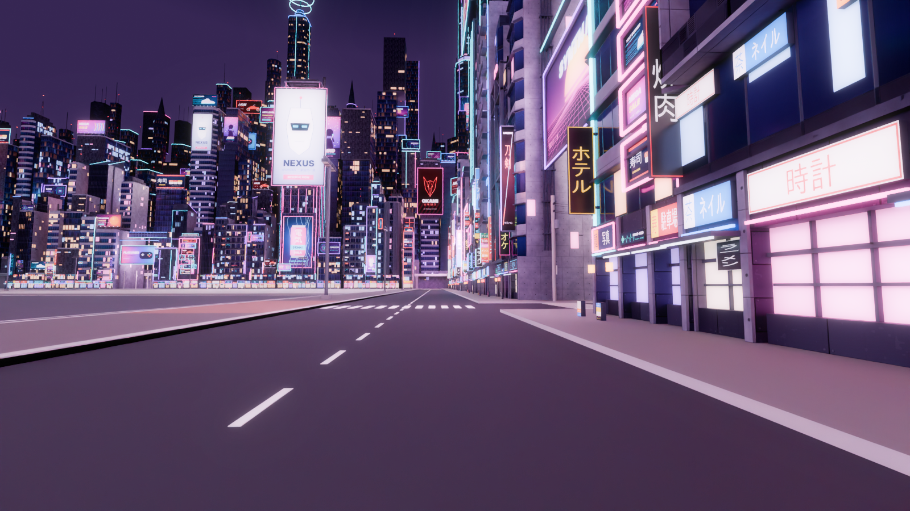 | 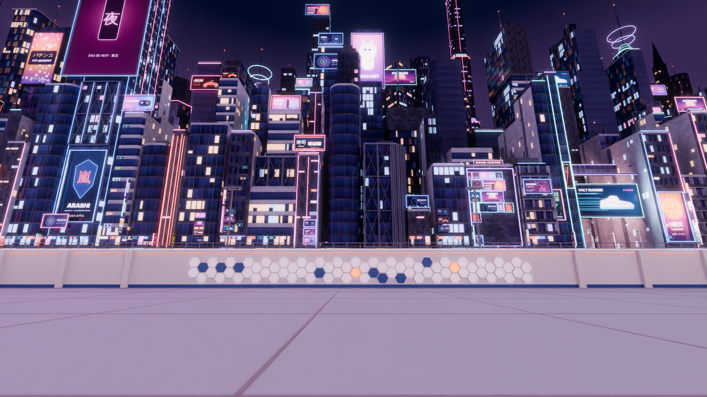 |
| 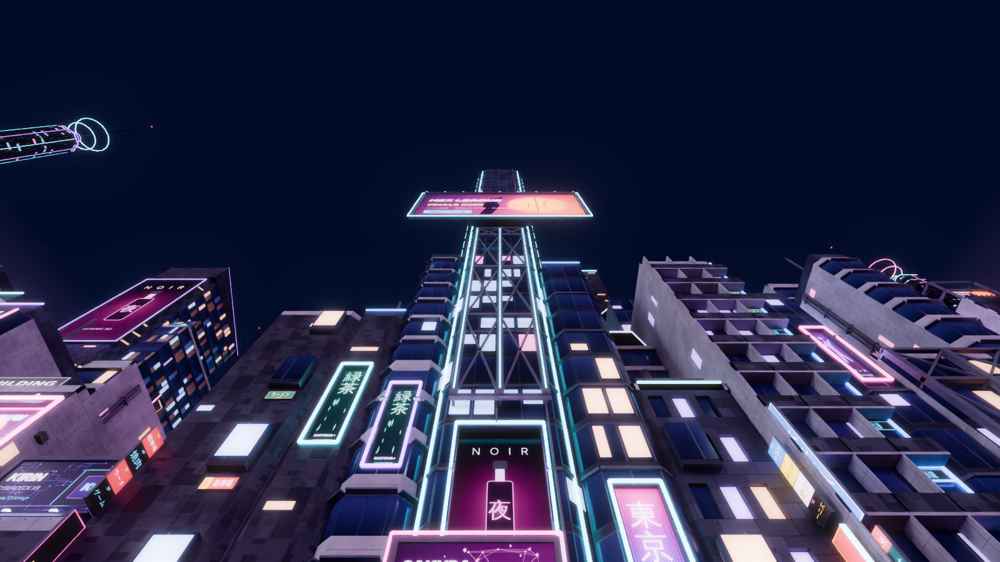 | 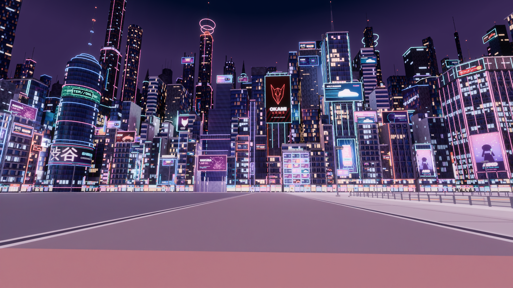 |
| 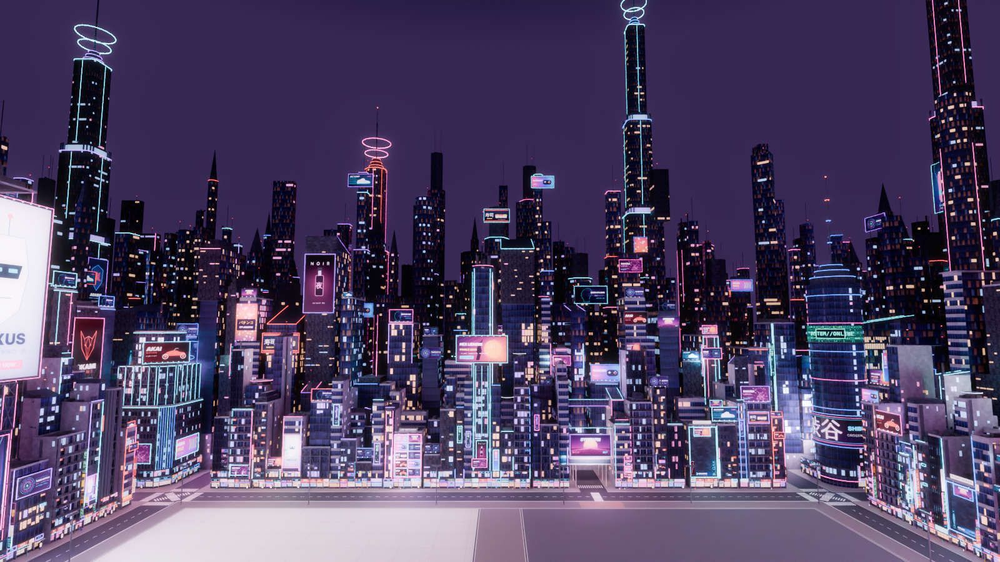 | 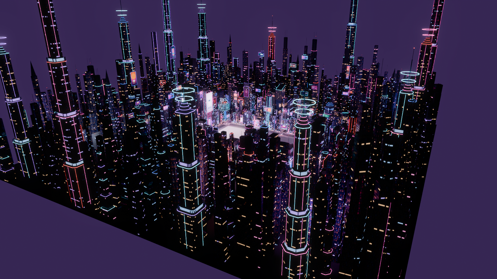 |

`player_*` views are from Roblox eye height (5 studs). The previews add an ambient fill, court flood spots and
coloured light from each large screen, matching what `CyberpunkSetup` creates in Roblox (OutdoorAmbient,
SpotLights, SurfaceLights); bloom is a 2D post effect.

## Rebuild

Uses Blender 5.2 (`pip install bpy==5.2.2` works headless) plus numpy / Pillow.

```sh
python blender/cp2_textures.py export/textures   # PBR texture sets
python blender/cp2_ads.py export/textures        # advertisement artwork
python blender/cp2_build.py                      # backup, rebuild, .blend, both FBX, Roblox data, CSVs
python blender/cp2_verify.py                     # re-import both FBX files and check them
python blender/cp2_guide.py                      # export/ROBLOX_SETUP_GUIDE.md
python export/roblox/build_rbxmx.py              # CyberpunkCityV2.rbxmx
python blender/cp2_render.py output/HEX_Cyberpunk_City.blend docs/previews_v2
```

The build is deterministic (seeded per lot name). Library: `cp2_lib.py` (geometry, materials, screens),
`cp2_arch.py` (facades, storefronts, signage, billboards, crowns, foreground archetypes), `cp2_arch2.py`
(corner landmarks, midground, skyline, megatowers, street gates).

## Legacy

`legacy_v1/` holds the previous version (neon dressing of the original boxes) for reference; it is superseded by `export/`.
